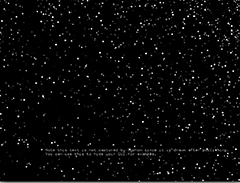

#Project No. 2

-------

For my second project, I wanted to start to integrate Open Frameworks with video by running what I built into video processing software that I use in my work:

* I created a series of textures, that I integrated into the software Isadora via Syphon

* I am still having difficulty with the Syphon addon and I can only get the code to run from the examples folder - if I move it elsewhere it looses the link to the Syphon.h file.  I have have links to sights about how to fix this but I have not been able to make it work yet.  

* The code included here does not have the full Syphon code.
I am not sure how to get the exmamples uploaded to my GitHub since they are in a different directory.

* If I make the debugs into little appps, they still run in Isadora - these are inclded in the folder labelled Apps.

	
	
