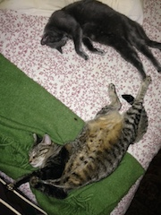
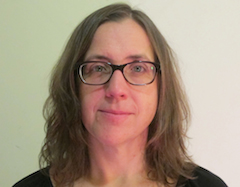

#Lauren Petty Bio Update

-------

To practice markdown - here is a list of bio facts:

* I am an artist working in media installation, performance, and documentary
* I am PT faculty at TNS - teaching Media Design (NSPE) and Time (Parsons)
* I already have an MA in Video Art and Performance from NYU (so why am I doing this again...)
* I have two cats - and since I am learning to embed photos here they are: 
 

### Full Bio
Lauren is a digital media artist working in video, film, sound, installation, interactive design and performance, she is a longtime collaborator of multi-disciplinary artist Shaun Irons. Their work has been exhibited in diverse locations in New York and internationally and was recently seen at BAM's Next Wave Festival (in collaboration with Phantom Limb), The New York Electronic Arts Festival, Abrons Arts Center, The Chocolate Factory, HERE, The Center for Contemporary Arts, Santa Fe, The Governors Island Art Fair, and was broadcast on PBS's Reel NY. Their video design work has been seen at venues such as St. Ann's Warehouse, The Public Theater, HERE, PS 122, The Kitchen, the Pompidou Center, Paris, Holland Dance Festival, the Noorderzon Festival, the Venice Biennale, and the BAM Next Wave Festival. Awards include two NYFA Fellowships, grants from the NEA, NYSCA, Jerome Foundation, the Greenwall Foundation, the Experimental TV Center, and the Asian Cultural Council, as well as residency fellowships from the MacDowell Colony, Yaddo, LMCC, Harvestworks, Signal Culture, The Bogliasco Foundation and the Tokyo Wonder Site.

Lauren received an MA in Media Art and Peformance from New York University and a BA in Art History from Northwestern. She is an Associate Teaching Professor in the Department of Media Studies at The New School and Parsons, a lecturer at The International Center of Photography and Pratt Institute, a teaching artist at The Kitchen and has been visiting faculty  at Sarah Lawrence College, Bard, and Wesleyan.

